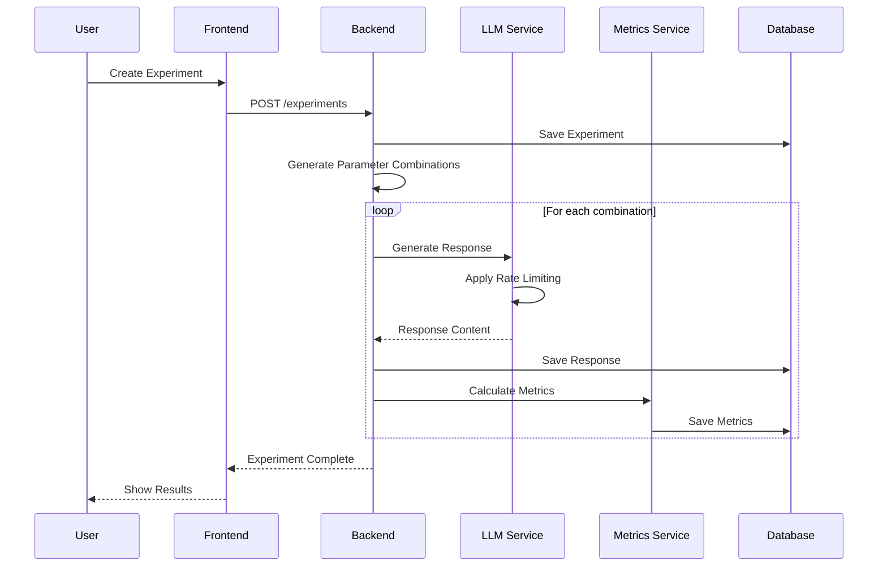
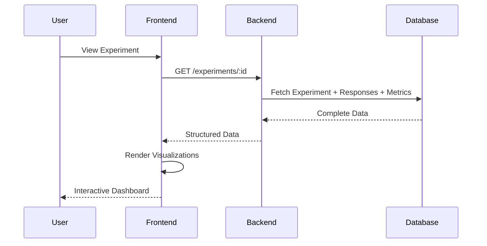

# LLM Lab - Architectural Documentation

## Overview

LLM Lab is a full-stack web application designed for experimenting with Large Language Model (LLM) parameters and analyzing response quality. The system enables users to systematically test different parameter combinations and evaluate responses using custom quality metrics.

## Architectural Approach and Key Decisions

### Design Philosophy

The LLM Lab system was designed with the following core principles:

1. **Modular Architecture**: Clear separation of concerns with independent, testable modules
2. **Type Safety**: Comprehensive TypeScript usage for compile-time error prevention
3. **Performance First**: Optimized for handling multiple concurrent LLM API calls
4. **Developer Experience**: Intuitive APIs, comprehensive documentation, and hot reloading
5. **Scalability**: Designed to handle growing experiment volumes and user base

### Key Architectural Decisions

#### 1. **Full-Stack TypeScript**

- **Decision**: Use TypeScript for both frontend and backend
- **Rationale**: Type safety, better developer experience, reduced runtime errors
- **Impact**: Consistent type definitions across the stack, easier refactoring

#### 2. **NestJS for Backend**

- **Decision**: Choose NestJS over Express.js or other Node.js frameworks
- **Rationale**:
  - Built-in dependency injection
  - Modular architecture with decorators
  - Excellent TypeScript support
  - Enterprise-grade features (guards, interceptors, pipes)
- **Impact**: Cleaner code organization, easier testing, better maintainability

#### 3. **Next.js App Router**

- **Decision**: Use Next.js 16 with App Router over Pages Router
- **Rationale**:
  - Server-side rendering for better performance
  - Built-in API routes (though we use separate backend)
  - Excellent TypeScript integration
  - Modern React features support
- **Impact**: Better SEO, faster initial page loads, modern React patterns

#### 4. **Prisma ORM**

- **Decision**: Use Prisma over raw SQL or other ORMs
- **Rationale**:
  - Type-safe database operations
  - Excellent migration system
  - Built-in connection pooling
  - Great developer experience
- **Impact**: Reduced database errors, easier schema management, type safety

#### 5. **PostgreSQL for Production**

- **Decision**: Use PostgreSQL over MySQL or other databases
- **Rationale**:
  - ACID compliance for data integrity
  - Excellent JSON support for flexible data storage
  - Strong consistency guarantees
  - Mature ecosystem and tooling
- **Impact**: Reliable data storage, better performance for complex queries

#### 6. **Custom Quality Metrics**

- **Decision**: Implement custom quality metrics instead of using existing libraries
- **Rationale**:
  - Tailored to LLM response evaluation
  - Full control over scoring algorithms
  - Ability to fine-tune for specific use cases
  - No external dependencies for core functionality
- **Impact**: More accurate evaluation, customizable scoring, better insights

#### 7. **Rate Limiting Strategy**

- **Decision**: Implement custom rate limiting instead of using external services
- **Rationale**:
  - Control over rate limiting logic
  - Integration with application flow
  - Cost-effective solution
  - Customizable for different API providers
- **Impact**: Prevents API quota exhaustion, better cost control

### Data Flow Architecture

#### Experiment Creation Flow

```
User Input → Frontend Validation → API Request → Backend Validation →
Parameter Generation → LLM API Calls → Response Storage →
Metrics Calculation → Database Storage → Frontend Update
```

#### Key Data Flow Decisions:

1. **Synchronous Processing**: Experiments run synchronously to provide immediate feedback
2. **Automatic Metrics**: Quality metrics are calculated automatically after each response
3. **Immediate Storage**: Responses are stored immediately to prevent data loss
4. **Real-time Updates**: Frontend updates in real-time as experiments complete

### API Design Decisions

#### RESTful Architecture

- **Decision**: Use RESTful API design over GraphQL
- **Rationale**: Simpler implementation, better caching, easier debugging
- **Impact**: Clear API endpoints, standard HTTP methods, predictable responses

#### Endpoint Structure

```
POST /experiments          # Create and run experiment
GET  /experiments          # List all experiments
GET  /experiments/:id      # Get experiment details
GET  /experiments/:id/export # Export experiment data
POST /test-llm            # Test LLM connection
```

#### Key API Decisions:

1. **Single Responsibility**: Each endpoint has a clear, single purpose
2. **Consistent Response Format**: All responses follow the same structure
3. **Error Handling**: Comprehensive error responses with appropriate HTTP status codes
4. **Validation**: Input validation using class-validator decorators

### Component Structure Decisions

#### Frontend Component Architecture

```
src/
├── app/                    # Next.js App Router pages
│   ├── page.tsx           # Home page
│   ├── experiments/       # Experiment pages
│   └── layout.tsx         # Root layout
├── components/            # Reusable UI components
│   ├── ui/               # Base UI components
│   ├── MetricsVisualization.tsx
│   ├── ParameterAnalysis.tsx
│   └── ResponseComparison.tsx
└── lib/                  # Utilities and API client
    ├── api.ts            # API client functions
    ├── types.ts          # TypeScript type definitions
    └── utils.ts          # Utility functions
```

#### Backend Module Architecture

```
src/
├── experiments/           # Experiment management
│   ├── experiments.controller.ts
│   ├── experiments.service.ts
│   └── dto/
├── llm/                  # LLM integration
│   ├── llm.service.ts
│   └── rate-limiter.service.ts
├── metrics/              # Quality metrics
│   ├── metrics.service.ts
│   ├── utils/            # Metric calculation utilities
│   └── types/
└── prisma/               # Database service
    └── prisma.service.ts
```

#### Key Component Decisions:

1. **Separation of Concerns**: Clear boundaries between UI, business logic, and data
2. **Reusable Components**: Shared UI components for consistency
3. **Type Safety**: Comprehensive TypeScript interfaces
4. **Modular Design**: Independent, testable modules

## System Architecture

### High-Level Architecture

```
┌─────────────────┐    ┌─────────────────┐    ┌─────────────────┐
│   Frontend      │    │   Backend API   │    │   Database      │
│   (Vercel)      │◄──►│   (Railway)     │◄──►│   (PostgreSQL)  │
│                 │    │                 │    │                 │
│ • Next.js 16    │    │ • NestJS 11     │    │ • Prisma ORM    │
│ • React 19      │    │ • TypeScript    │    │ • Railway DB    │
│ • Tailwind CSS  │    │ • REST API      │    │ • Migrations    │
│ • Global CDN    │    │ • Rate Limiting │    │ • Backups       │
└─────────────────┘    └─────────────────┘    └─────────────────┘
                                │
                                ▼
                       ┌─────────────────┐
                       │   External APIs │
                       │                 │
                       │ • Google Gemini │
                       │ • AI Studio     │
                       └─────────────────┘
```

### Component Architecture

#### Frontend (Next.js 16 on Vercel)

- **Framework**: Next.js 16 with App Router
- **Hosting**: Vercel with global CDN
- **UI Library**: React 19 with TypeScript
- **Styling**: Tailwind CSS 4 with custom components
- **Charts**: Recharts for data visualization
- **Forms**: React Hook Form with Zod validation
- **State Management**: Server-side rendering with client-side hydration
- **Performance**: Automatic optimizations, edge caching, and image optimization

#### Backend (NestJS on Railway)

- **Framework**: NestJS with TypeScript
- **Hosting**: Railway with automatic deployments
- **Architecture**: Modular design with dependency injection
- **API**: RESTful endpoints with validation
- **Rate Limiting**: Custom rate limiter for LLM API calls
- **Error Handling**: Comprehensive error handling and logging
- **Database**: PostgreSQL with Prisma ORM

#### Database Layer

- **ORM**: Prisma with type-safe database operations
- **Database**: PostgreSQL (production) / SQLite (development)
- **Schema**: Normalized design with proper relationships
- **Migrations**: Version-controlled database schema changes

## Core Modules

### 1. Experiment Management Module

**Purpose**: Handles experiment creation, execution, and data management.

**Key Components**:

- `ExperimentsController`: REST API endpoints
- `ExperimentsService`: Business logic for experiment operations
- `CreateExperimentDto`: Data validation and transformation

**Responsibilities**:

- Create new experiments with parameter ranges
- Generate parameter combinations automatically
- Execute experiments by calling LLM service
- Store experiment results and metadata

**Data Flow**:

```
User Input → Validation → Parameter Generation → LLM Calls → Response Storage → Metrics Calculation
```

### 2. LLM Integration Module

**Purpose**: Manages communication with external LLM APIs.

**Key Components**:

- `LlmService`: Core LLM interaction logic
- `RateLimiterService`: Controls API call frequency
- `LLMParameters`: Type-safe parameter definitions

**Features**:

- Google Gemini API integration
- Configurable parameter support (temperature, top-p, top-k, max-tokens)
- Rate limiting to prevent quota exhaustion
- Error handling for API failures and rate limits

**Rate Limiting Strategy**:

- Maximum 3 concurrent requests
- 2-second delay between requests
- Automatic retry with exponential backoff

### 3. Quality Metrics Module

**Purpose**: Calculates and analyzes response quality using custom algorithms.

**Key Components**:

- `MetricsService`: Orchestrates metric calculations
- `CoherenceUtil`: Logical flow and consistency analysis
- `CompletenessUtil`: Prompt addressing evaluation
- `LengthUtil`: Response length appropriateness
- `StructureUtil`: Paragraph organization analysis
- `VocabularyUtil`: Vocabulary diversity assessment

**Metrics Overview**:

| Metric       | Range | Description                             | Weight |
| ------------ | ----- | --------------------------------------- | ------ |
| Coherence    | 0-1   | Logical flow and consistency            | 0.25   |
| Completeness | 0-1   | How well response addresses prompt      | 0.25   |
| Length       | 0-1   | Appropriate response length             | 0.20   |
| Structure    | 0-1   | Paragraph structure and organization    | 0.15   |
| Vocabulary   | 0-1   | Vocabulary diversity and sophistication | 0.15   |

**Overall Score**: Weighted average of all metrics (0-1 scale)

### 4. Database Module

**Purpose**: Manages data persistence and retrieval.

**Key Components**:

- `PrismaService`: Database connection and operations
- `PrismaModule`: Module configuration and dependency injection

**Schema Design**:

```sql
Experiment (1) ──→ (N) Response (1) ──→ (1) ResponseMetrics
```

**Tables**:

- `experiments`: Experiment configuration and metadata
- `responses`: Generated responses with parameters
- `response_metrics`: Calculated quality metrics

**Relationships**:

- Cascade deletes for data integrity
- Foreign key constraints
- Indexed fields for performance

## Data Flow Architecture

### Experiment Creation Flow



### Response Analysis Flow



## Security Architecture

### API Security

- **CORS**: Configured for specific frontend origins
- **Input Validation**: Class-validator for request validation
- **Error Handling**: Sanitized error messages
- **Rate Limiting**: Prevents API abuse

### Data Security

- **Environment Variables**: Sensitive data in environment config
- **Database**: Connection strings and credentials secured
- **API Keys**: Google AI API key stored securely

### Frontend Security

- **Type Safety**: TypeScript for compile-time safety
- **Input Sanitization**: Form validation with Zod
- **XSS Protection**: React's built-in XSS protection

## Performance Architecture

### Backend Performance

- **Connection Pooling**: Prisma connection management
- **Rate Limiting**: Prevents API quota exhaustion
- **Error Recovery**: Graceful handling of API failures
- **Logging**: Structured logging for monitoring

### Frontend Performance

- **Server-Side Rendering**: Next.js SSR for initial load
- **Static Generation**: Pre-built pages where possible
- **Code Splitting**: Automatic code splitting by Next.js
- **Image Optimization**: Next.js image optimization

### Database Performance

- **Indexing**: Strategic indexes on frequently queried fields
- **Query Optimization**: Prisma query optimization
- **Connection Management**: Efficient connection pooling

## Scalability Considerations

### Horizontal Scaling

- **Stateless Backend**: No server-side session storage
- **Database**: Can be scaled independently
- **Load Balancing**: Ready for load balancer deployment

### Vertical Scaling

- **Memory Management**: Efficient memory usage patterns
- **CPU Optimization**: Async operations for I/O bound tasks
- **Resource Monitoring**: Built-in logging and metrics

### Future Enhancements

- **Caching Layer**: Redis for response caching
- **Message Queue**: For async experiment processing
- **Microservices**: Split into smaller services if needed
- **CDN**: For static asset delivery

## Deployment Architecture

### Development Environment

- **Local Development**: Docker Compose for local setup
- **Hot Reloading**: Development servers with hot reload
- **Database**: SQLite for development simplicity

### Production Environment

- **Containerization**: Docker containers for deployment
- **Database**: PostgreSQL for production reliability
- **Environment**: Railway deployment with environment variables
- **Monitoring**: Application logging and error tracking

### CI/CD Pipeline

- **Build Process**: Automated builds with pnpm
- **Testing**: Jest for unit and integration tests
- **Deployment**: Automated deployment to Railway
- **Database Migrations**: Automated schema updates

## Monitoring and Observability

### Logging

- **Structured Logging**: JSON-formatted logs
- **Log Levels**: Debug, Info, Warn, Error
- **Context**: Request IDs and user context

### Metrics

- **Application Metrics**: Response times, error rates
- **Business Metrics**: Experiment success rates, API usage
- **System Metrics**: Database performance, memory usage

### Error Tracking

- **Error Boundaries**: React error boundaries
- **Exception Handling**: Comprehensive error handling
- **Alerting**: Error rate monitoring and alerting

## API Design

### RESTful Endpoints

| Method | Endpoint                  | Description            | Request Body           | Response                  |
| ------ | ------------------------- | ---------------------- | ---------------------- | ------------------------- |
| POST   | `/test-llm`               | Test LLM connection    | `{prompt, parameters}` | `{content, usage}`        |
| POST   | `/experiments`            | Create experiment      | `CreateExperimentDto`  | `Experiment`              |
| GET    | `/experiments`            | List experiments       | -                      | `Experiment[]`            |
| GET    | `/experiments/:id`        | Get experiment details | -                      | `ExperimentWithResponses` |
| GET    | `/experiments/:id/export` | Export experiment data | -                      | `ExperimentExport`        |

### Data Transfer Objects (DTOs)

**CreateExperimentDto**:

```typescript
{
  name: string;
  description?: string;
  prompt: string;
  temperatureMin: number;
  temperatureMax: number;
  topPMin: number;
  topPMax: number;
  topKMin: number;
  topKMax: number;
  maxTokensMin: number;
  maxTokensMax: number;
}
```

### Response Formats

**Standard Response**:

```typescript
{
  id: string;
  name: string;
  description?: string;
  prompt: string;
  createdAt: string;
  updatedAt: string;
  model: string;
  // ... parameter ranges
}
```

**Experiment with Responses**:

```typescript
{
  // ... experiment fields
  responses: Array<{
    id: string;
    temperature: number;
    topP: number;
    topK: number;
    maxTokens: number;
    content: string;
    metrics?: {
      overallScore: number;
      coherenceScore: number;
      completenessScore: number;
      lengthScore: number;
      structureScore: number;
      vocabularyScore: number;
    };
  }>;
}
```

## Development Guidelines

### Code Organization

- **Modular Structure**: Clear separation of concerns
- **Type Safety**: Comprehensive TypeScript usage
- **Error Handling**: Consistent error handling patterns
- **Testing**: Unit tests for critical business logic

### Best Practices

- **SOLID Principles**: Single responsibility, dependency injection
- **Clean Code**: Readable, maintainable code
- **Documentation**: Comprehensive inline documentation
- **Version Control**: Semantic versioning and clear commit messages

### Code Quality

- **Linting**: ESLint with Prettier for code formatting
- **Type Checking**: Strict TypeScript configuration
- **Testing**: Jest for unit and integration tests
- **Code Review**: Peer review process for changes

This architectural documentation provides a comprehensive overview of the LLM Lab system, covering all major components, data flows, and design decisions. It serves as a reference for developers, architects, and stakeholders to understand the system's structure and capabilities.
