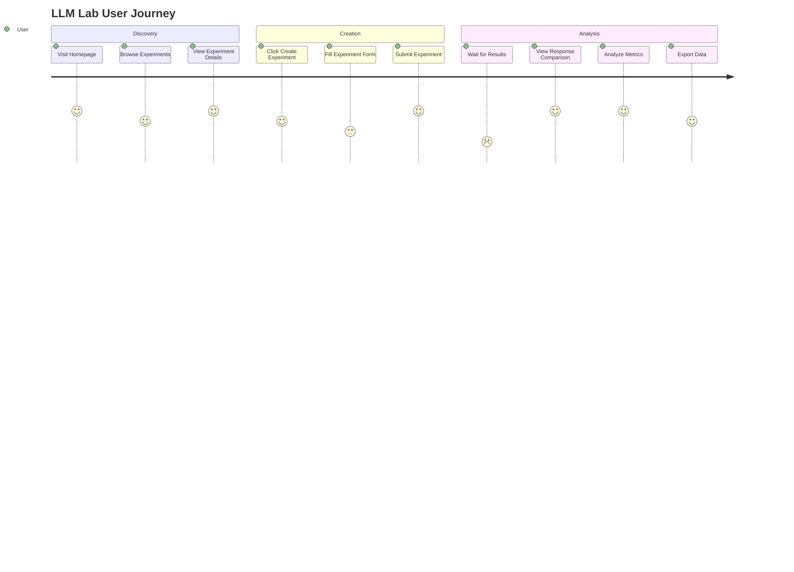

# LLM Lab - UI/UX Design Documentation

## Design Philosophy

The LLM Lab interface was designed with the following core principles:

1. **Clarity First**: Complex data should be presented in an intuitive, easy-to-understand format
2. **Progressive Disclosure**: Information is revealed progressively to avoid overwhelming users
3. **Data-Driven Design**: Every interface element serves a purpose in the experiment analysis workflow
4. **Accessibility**: The interface should be usable by people with different abilities and devices
5. **Performance**: Fast, responsive interactions that don't hinder the experimentation process

## User Journey and Experience Flow

### Primary User Journey



### Detailed User Flow

#### 1. **Landing Experience**

- **Entry Point**: Clean, focused homepage with clear value proposition
- **Primary Action**: Prominent "Create Experiment" button
- **Secondary Actions**: Browse existing experiments, view documentation
- **Information Architecture**: Experiment cards with key metadata (name, model, date)

#### 2. **Experiment Creation Flow**

- **Form Design**: Single-page form with logical grouping
- **Validation**: Real-time validation with helpful error messages
- **Parameter Input**: Intuitive sliders and number inputs for parameter ranges
- **Preview**: Clear indication of how many combinations will be generated
- **Submission**: Loading states and progress indicators

#### 3. **Results Analysis Experience**

- **Tabbed Interface**: Organized information in digestible sections
- **Progressive Disclosure**: Start with overview, drill down to details
- **Interactive Elements**: Hover states, clickable elements, responsive charts
- **Export Options**: Easy data export for further analysis

## Visual Design System

### Color Palette

#### Primary Colors

- **Primary Blue**: `#3b82f6` (rgb(59, 130, 246))

  - Used for: Primary buttons, links, active states
  - Psychology: Trust, reliability, technology

- **Success Green**: `#10b981` (rgb(16, 185, 129))

  - Used for: Success states, positive metrics, completion indicators
  - Psychology: Growth, success, positive outcomes

- **Warning Orange**: `#f59e0b` (rgb(245, 158, 11))

  - Used for: Warnings, attention-grabbing elements
  - Psychology: Caution, attention, energy

- **Error Red**: `#ef4444` (rgb(239, 68, 68))
  - Used for: Errors, negative metrics, critical states
  - Psychology: Urgency, attention, problems

#### Neutral Colors

- **Background**: `#ffffff` (white) - Clean, professional
- **Surface**: `#f8fafc` (gray-50) - Subtle contrast for cards
- **Border**: `#e2e8f0` (gray-200) - Subtle separators
- **Text Primary**: `#1e293b` (gray-800) - High contrast for readability
- **Text Secondary**: `#64748b` (gray-500) - Supporting information

#### Metric-Specific Colors

- **Coherence**: `#10b981` (green) - Logical, structured
- **Completeness**: `#8b5cf6` (purple) - Comprehensive, thorough
- **Length**: `#f59e0b` (orange) - Balanced, measured
- **Structure**: `#ef4444` (red) - Organized, systematic
- **Vocabulary**: `#6366f1` (indigo) - Rich, diverse

### Typography

#### Font Stack

- **Primary**: Geist Sans (modern, clean, highly readable)
- **Monospace**: Geist Mono (for code, data, technical content)
- **Fallback**: system-ui, -apple-system, sans-serif

#### Typography Scale

- **Heading 1**: `text-3xl font-bold` (30px) - Page titles
- **Heading 2**: `text-2xl font-bold` (24px) - Section headers
- **Heading 3**: `text-xl font-semibold` (20px) - Subsection headers
- **Body**: `text-base` (16px) - Main content
- **Small**: `text-sm` (14px) - Supporting text, captions
- **Extra Small**: `text-xs` (12px) - Fine print, metadata

### Spacing and Layout

#### Spacing Scale (Tailwind CSS)

- **xs**: `4px` - Tight spacing for related elements
- **sm**: `8px` - Small gaps between elements
- **md**: `16px` - Standard spacing between sections
- **lg**: `24px` - Large spacing for major sections
- **xl**: `32px` - Extra large spacing for page sections
- **2xl**: `48px` - Maximum spacing for major page divisions

#### Grid System

- **Container**: `max-w-7xl mx-auto` - Centered, responsive container
- **Grid**: CSS Grid and Flexbox for responsive layouts
- **Breakpoints**: Mobile-first responsive design
  - `sm`: 640px
  - `md`: 768px
  - `lg`: 1024px
  - `xl`: 1280px
  - `2xl`: 1536px

## Component Design System

### Button Components

#### Primary Button

```typescript
// Primary action button
<Button className="bg-blue-600 hover:bg-blue-700 text-white">
  Create Experiment
</Button>
```

#### Secondary Button

```typescript
// Secondary action button
<Button variant="outline" className="border-gray-300 hover:bg-gray-50">
  Cancel
</Button>
```

#### Button States

- **Default**: Standard appearance
- **Hover**: Subtle color change, cursor pointer
- **Active**: Pressed state with slight scale
- **Disabled**: Reduced opacity, no interaction
- **Loading**: Spinner icon, disabled state

### Card Components

#### Experiment Card

```typescript
<Card className="transition-shadow hover:shadow-md">
  <CardHeader>
    <CardTitle>{experiment.name}</CardTitle>
    <CardDescription>{experiment.description}</CardDescription>
  </CardHeader>
  <CardContent>{/* Experiment metadata and actions */}</CardContent>
</Card>
```

#### Card Design Principles

- **Elevation**: Subtle shadow for depth
- **Hover States**: Enhanced shadow on hover
- **Content Hierarchy**: Clear header, body, footer structure
- **Responsive**: Adapts to different screen sizes

### Form Components

#### Input Fields

```typescript
<Input
  type="number"
  placeholder="Enter value"
  className="border-gray-300 focus:border-blue-500 focus:ring-blue-500"
/>
```

#### Form Design Principles

- **Labeling**: Clear, descriptive labels
- **Validation**: Real-time feedback with error states
- **Accessibility**: Proper ARIA labels and descriptions
- **Responsive**: Full-width on mobile, constrained on desktop

### Data Visualization Components

#### Chart Components

- **Line Charts**: For trend analysis (overall scores over time)
- **Bar Charts**: For metric comparisons (individual metric scores)
- **Scatter Plots**: For correlation analysis (parameter vs. performance)
- **Responsive**: Adapts to container size

#### Chart Design Principles

- **Color Consistency**: Same colors for same metrics across charts
- **Accessibility**: High contrast, readable labels
- **Interactivity**: Hover states, tooltips, clickable elements
- **Responsive**: Scales appropriately on different devices

## Information Architecture

### Navigation Structure

#### Primary Navigation

- **Home**: Dashboard with experiment overview
- **Experiments**: List of all experiments
- **Create**: New experiment creation
- **Documentation**: Help and guides

#### Secondary Navigation

- **Experiment Details**: Tabs for different views
  - Responses: Individual response viewing
  - Performance: Metrics visualization
  - Analysis: Parameter analysis
  - Comparison: Side-by-side comparison

### Content Organization

#### Homepage Layout

```
┌─────────────────────────────────────────┐
│ Header: Logo, Navigation                │
├─────────────────────────────────────────┤
│ Hero: Title, Description, CTA           │
├─────────────────────────────────────────┤
│ Experiments Grid:                       │
│ ┌─────────┐ ┌─────────┐ ┌─────────┐    │
│ │ Exp 1   │ │ Exp 2   │ │ Exp 3   │    │
│ └─────────┘ └─────────┘ └─────────┘    │
└─────────────────────────────────────────┘
```

#### Experiment Detail Layout

```
┌─────────────────────────────────────────┐
│ Header: Back, Title, Export             │
├─────────────────────────────────────────┤
│ Experiment Info: Parameters, Prompt     │
├─────────────────────────────────────────┤
│ Tabs: Responses | Performance | Analysis│
├─────────────────────────────────────────┤
│ Content: Dynamic based on active tab    │
└─────────────────────────────────────────┘
```

## Responsive Design Strategy

### Mobile-First Approach

#### Mobile (< 768px)

- **Single Column**: Stack all content vertically
- **Touch-Friendly**: Larger touch targets (44px minimum)
- **Simplified Navigation**: Collapsible menu
- **Condensed Cards**: Essential information only
- **Swipe Gestures**: For chart navigation

#### Tablet (768px - 1024px)

- **Two Column**: Sidebar navigation, main content
- **Larger Cards**: More information visible
- **Touch + Mouse**: Support both interaction methods
- **Responsive Charts**: Optimized for medium screens

#### Desktop (> 1024px)

- **Multi-Column**: Full grid layouts
- **Hover States**: Rich interactive elements
- **Keyboard Navigation**: Full keyboard support
- **Large Charts**: Detailed data visualization

### Breakpoint Strategy

```css
/* Mobile First */
.container {
  padding: 1rem;
}

/* Tablet */
@media (min-width: 768px) {
  .container {
    padding: 2rem;
  }
  .grid {
    grid-template-columns: repeat(2, 1fr);
  }
}

/* Desktop */
@media (min-width: 1024px) {
  .container {
    padding: 3rem;
  }
  .grid {
    grid-template-columns: repeat(3, 1fr);
  }
}
```

## Accessibility Design

### WCAG 2.1 AA Compliance

#### Color Contrast

- **Text**: Minimum 4.5:1 contrast ratio
- **Large Text**: Minimum 3:1 contrast ratio
- **Interactive Elements**: Clear focus states

#### Keyboard Navigation

- **Tab Order**: Logical tab sequence
- **Focus Indicators**: Visible focus states
- **Skip Links**: Jump to main content
- **Keyboard Shortcuts**: Common actions

#### Screen Reader Support

- **Semantic HTML**: Proper heading structure
- **ARIA Labels**: Descriptive labels for complex elements
- **Alt Text**: Meaningful image descriptions
- **Live Regions**: Dynamic content announcements

### Accessibility Features

```typescript
// Example accessible button
<Button
  aria-label="Create new experiment"
  aria-describedby="create-help"
  className="focus:ring-2 focus:ring-blue-500 focus:ring-offset-2"
>
  Create Experiment
</Button>
```

## Interaction Design

### Micro-Interactions

#### Loading States

- **Skeleton Screens**: Placeholder content during loading
- **Progress Indicators**: Clear progress for long operations
- **Spinner Animations**: Subtle loading indicators
- **Pulse Effects**: Gentle animation for attention

#### Hover Effects

- **Button Hover**: Color transition, slight scale
- **Card Hover**: Shadow enhancement, subtle lift
- **Link Hover**: Color change, underline
- **Chart Hover**: Data point highlighting, tooltips

#### Feedback Mechanisms

- **Success States**: Green checkmarks, success messages
- **Error States**: Red indicators, clear error messages
- **Warning States**: Orange indicators, caution messages
- **Info States**: Blue indicators, helpful information

### Animation Principles

- **Duration**: 150-300ms for most interactions
- **Easing**: Ease-out for entrances, ease-in for exits
- **Purpose**: Every animation serves a functional purpose
- **Performance**: GPU-accelerated transforms, no layout thrashing

## User Experience Patterns

### Progressive Disclosure

1. **Overview First**: Show summary information initially
2. **Drill Down**: Allow users to explore details on demand
3. **Context Preservation**: Maintain context when navigating
4. **Breadcrumbs**: Clear navigation path

### Error Prevention

1. **Validation**: Real-time form validation
2. **Confirmation**: Important actions require confirmation
3. **Undo**: Reversible actions where possible
4. **Clear Labels**: Unambiguous interface labels

### Performance Optimization

1. **Lazy Loading**: Load content as needed
2. **Optimistic Updates**: Show expected results immediately
3. **Caching**: Cache frequently accessed data
4. **Progressive Enhancement**: Core functionality works without JavaScript

## Design Tokens

### Spacing Tokens

```typescript
const spacing = {
  xs: "4px",
  sm: "8px",
  md: "16px",
  lg: "24px",
  xl: "32px",
  "2xl": "48px",
  "3xl": "64px",
};
```

### Color Tokens

```typescript
const colors = {
  primary: {
    50: "#eff6ff",
    500: "#3b82f6",
    600: "#2563eb",
    700: "#1d4ed8",
  },
  success: {
    500: "#10b981",
    600: "#059669",
  },
  warning: {
    500: "#f59e0b",
    600: "#d97706",
  },
  error: {
    500: "#ef4444",
    600: "#dc2626",
  },
};
```

### Typography Tokens

```typescript
const typography = {
  fontFamily: {
    sans: ["Geist Sans", "system-ui", "sans-serif"],
    mono: ["Geist Mono", "monospace"],
  },
  fontSize: {
    xs: "12px",
    sm: "14px",
    base: "16px",
    lg: "18px",
    xl: "20px",
    "2xl": "24px",
    "3xl": "30px",
  },
};
```

## Design System Implementation

### Component Library

- **Base Components**: Button, Input, Card, Badge
- **Composite Components**: Form, Table, Chart
- **Layout Components**: Container, Grid, Stack
- **Feedback Components**: Alert, Toast, Modal

### Design System Benefits

1. **Consistency**: Uniform look and feel across the application
2. **Efficiency**: Reusable components reduce development time
3. **Maintainability**: Centralized design decisions
4. **Scalability**: Easy to add new components and features

## Future Design Considerations

### Planned Enhancements

1. **Dark Mode**: Alternative color scheme for low-light usage
2. **Custom Themes**: User-customizable color schemes
3. **Advanced Charts**: More sophisticated data visualization
4. **Mobile App**: Native mobile application
5. **Accessibility**: Enhanced screen reader support

### Design Evolution

- **User Feedback**: Regular user testing and feedback incorporation
- **A/B Testing**: Data-driven design decisions
- **Performance**: Continuous optimization for speed and usability
- **Accessibility**: Ongoing compliance improvements

This UI/UX design documentation provides a comprehensive overview of the design decisions, user experience patterns, and visual design system used in LLM Lab. It serves as a reference for designers, developers, and stakeholders to understand the user interface and experience design principles.
